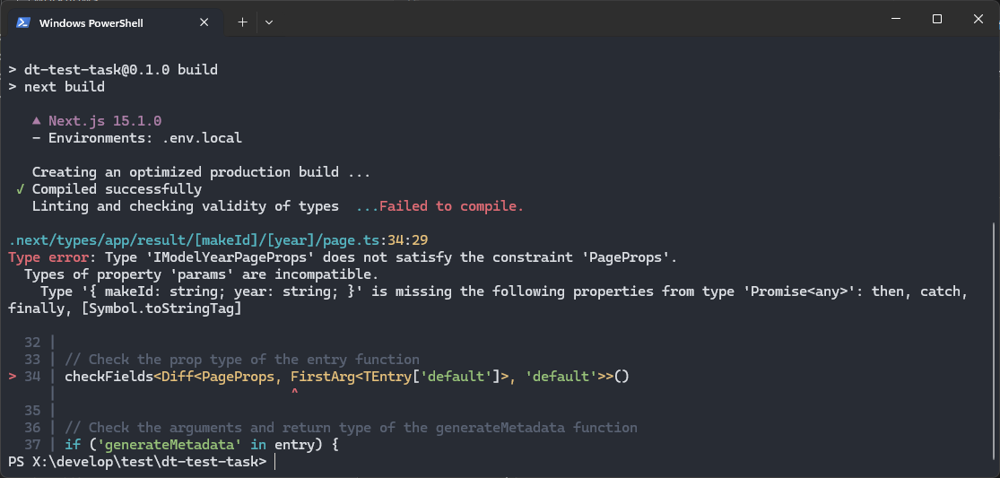

This is a [Next.js](https://nextjs.org) project bootstrapped with [`create-next-app`](https://nextjs.org/docs/app/api-reference/cli/create-next-app).

# Project Setup and Run Instructions

## Prerequisites
- **Node.js**: Ensure you have Node.js (version 16 or later recommended) installed.
- **npm or yarn**: Have a package manager installed, such as npm (included with Node.js) or yarn.

## Getting Started

1. **Clone the Repository**:
   ```bash
   git clone https://github.com/pluxxury1999/dt-test-task

2. **Navigate into the Project Directory**:
   ```bash
   cd dt-test-task

3. **Install Dependencies**:
   ```bash
   npm install
   ```
   or
   ```bash
   yarn install
   ```
4. **Run the Development Server**:
   ```bash
   npm run dev
   ```
   or
   ```bash
   yarn dev
   ```
   The server should start at http://localhost:3000.

## Build for production
1. **Build the Project**:
   ```bash
   npm run build
   ```
   or
   ```bash
   yarn build
   ```

2. **Navigate into the Project Directory**:
   ```bash
   npm run start
   ```
   or
   ```bash
   yarn start
   ```
   
# Project overview
The task was to create an application that, by accessing the `API`, allows the user to view cars by the first parameters, namely the `manufacturer's ID` and `Year of manufacture`.

The task required the use of `Next.js + Tailwind CSS`. Additionally, added the `react-icons` library.

On the main page of the application, created a form with 2 dropdown fields that give the user the ability to select the `car brand` and `year` of manufacture, as well as a button that is a Next.js `<Link>` component.

By using the filter and clicking on the button, the user will receive a `list of car models of a specific manufacturer` that were produced in the year of their choice.

The styling is done with the help of `Tailwind CSS` and `CSS modules`, the chosen approach ensures the cleanliness of the component code

Instead of using `React.Suspense`, we used the `Next.JS Routing` feature, and the loading itself is performed using `loading.tsx` **[Official docs](https://nextjs.org/docs/app/building-your-application/routing/loading-ui-and-streaming)**

Also added `env.sample`(best practice) to the repository

**About optional task**

While trying to complete an additional task, I encountered the problem shown in the figure below.

I found several materials about this problem, but I was unable to solve it.

The result of this problem is that the project cannot be built either on the local machine or on GitPages using GitActions :((

**Thanks for attention!**